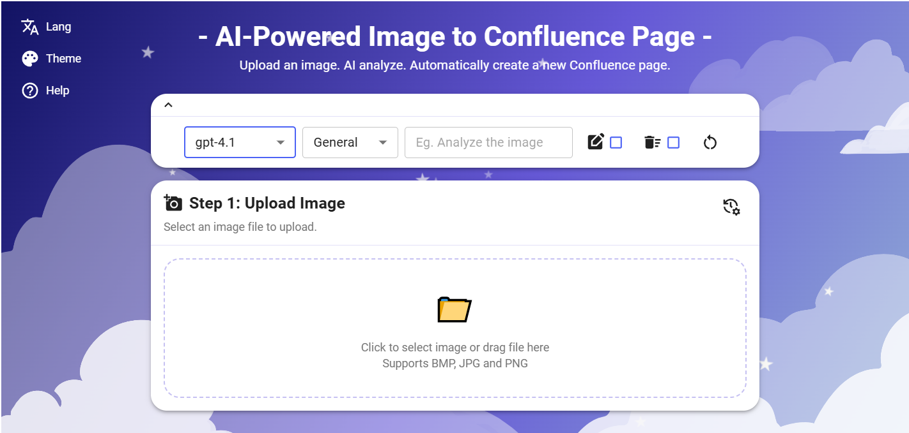

# 🪶 Conflux — AI-Generated Whiteboard Summary

Conflux is an **AI-powered visual understanding tool** that turns hand-drawn whiteboards into structured summaries ready for Confluence or any workspace.  
It combines **multimodal vision models**, **semantic reasoning**, and **prompt fusion** to extract insights, structure ideas, and generate clean, editable documentation.

### 🧠 Core AI Technologies
- **Multimodal Analysis:** Combines OpenAI GPT-4o and Google Gemini 2.5-Flash for cross-model reasoning on visual + textual input.  
- **Prompt Fusion Engine:** Dynamically merges user prompts with predefined templates for contextual precision.  
- **Adaptive Model Routing:** Automatically switches between models based on complexity and rate limits.  
- **Semantic Structuring:** Converts visual whiteboard elements into hierarchical, human-readable summaries.  
- **Multilingual Generation:** Generates summaries in English, Chinese, Japanese, French, and more.


## 🧩 Tech Stack

### Frontend
- **Framework:** React 18 + Vite
- **UI:** Material-UI + custom themes (Light, Dark, Accessibility)
- **Testing:** Vitest + React Testing Library + Playwright (E2E)
- **Features:**
  - Multilingual support (EN, ZH, JA, ES, FR, IT)
  - Theme switching (auto-detects Atlassian light/dark mode)
  - Guided onboarding and user history
  - Rebuild, Re-analyze, and Direct Publish to Confluence


### Backend
- **Server:** Node.js + Express
- **Database:** PostgreSQL via Drizzle ORM
- **Storage:** Supabase (image storage)
- **Queue:** Upstash Redis (background task processing)
- **AI Models:** Google Gemini & OpenAI GPT series
- **Testing:** Jest with unit + integration coverage
- **Deployment:** Dockerized (API + Worker containers)

#### Initial Screen (auto switches with GitHub theme)

<picture>
  <source media="(prefers-color-scheme: dark)"  srcset="assets/ui-dark.png">
  <source media="(prefers-color-scheme: light)" srcset="assets/ui-light.png">
  
</picture>

## 🧪 Testing

### Frontend
```bash
cd forge-frontend
npm install
npm test       # Unit tests
npx playwright test --headed  # E2E tests
```

### Backend
	cd forge-backend
	npm install
	npm test

## 🛠️ Development Setup

### Clone the repo
	git clone https://github.com/<your-username>/ai-whiteboard-summary.git
	cd ai-whiteboard-summary
### Start backend
	cd forge-backend
	npm install
	npm run dev
### Start frontend
	cd forge-frontend
	npm install
	npm run dev

#### Generated Summary Page
<p align="center">
  
  <br><em>AI-generated structured summary — ready to publish to Confluence</em>
</p>


### 🧱 Project Structure
	forge-backend/
	├── src/
	│   ├── ai/            # AI model logic
	│   ├── controllers/   # Express controllers
	│   ├── services/      # Business logic layer
	│   ├── routes/        # API endpoints
	│   └── app.js         # Main entrypoint
	└── tests/             # Jest tests

	forge-frontend/
	├── src/
	│   ├── components/    # React components
	│   ├── hooks/         # Custom hooks
	│   ├── theme/         # Themes and context
	│   ├── services/      # API integrations
	│   └── utils/         # Helper functions
	└── e2e/               # Playwright tests

### 🧠 AI Analysis Features

Multi-model (Gemini, GPT) adaptive selection

Business & general prompt templates

Custom prompt injection and intelligent fusion

Structured HTML output for Confluence pages

Multi-language summaries (EN, ZH, JP, etc.)

Security-filtered and privacy-preserving analysis

### 📅 Changelog Highlights

Jul 2025: Added onboarding flow, auto theme sync with Atlassian

Jun 2025: Implemented AI model fallback and multilingual summary

May 2025: Completed Dockerized backend deployment and Playwright E2E